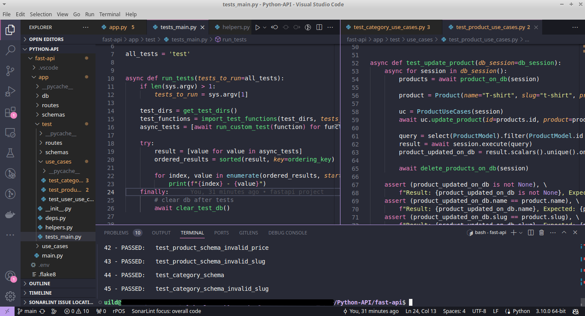

#Multilingual Content (Portuguese, English).

A seguir um breve resumo das bibliotecas que foram utilizados dentro desses projetos, e também sobre o Docker:

Poetry é um gerenciador de pacotes para Python que facilita a instalação, gerenciamento e atualização de pacotes Python. Ele é baseado no gerenciador de pacotes PyPI e oferece uma interface de linha de comando simples e intuitiva

Uvicorn: Uvicorn é um servidor web ASGI rápido e eficiente. Ele é frequentemente usado com FastAPI para executar APIs RESTful.

AsyncIO: AsyncIO é uma biblioteca Python para programação assíncrona. Ela possibilita a criação de código assíncrono usando corrotinas e um laço de eventos, permitindo o tratamento eficiente de tarefas concorrentes, especialmente em cenários de operações de I/O.

Pydantic: Pydantic é uma biblioteca para serializar e validar dados. Ele fornece uma sintaxe simples e intuitiva para definir modelos de dados, e inclui validação integrada para garantir que os dados sejam válidos.

SQLAlchemy: SQLAlchemy é uma biblioteca para acessar bancos de dados relacionais. Ele fornece uma API abstrata que permite acessar bancos de dados de diferentes tipos, sem a necessidade de aprender a sintaxe específica de cada banco de dados.

Alembic: Alembic é uma ferramenta para gerenciar o esquema de banco de dados. Ele permite que você faça alterações no esquema de banco de dados de forma segura e controlada.

Pytest: Pytest é uma biblioteca para testes automatizados. Ele fornece uma sintaxe simples e intuitiva para escrever testes, e inclui recursos avançados, como testes parametrizados e testes de integração.

Passlib: Passlib é uma biblioteca para gerar e verificar senhas seguras. Ele fornece um conjunto de algoritmos seguros para geração e verificação de senhas, e inclui recursos para dificultar a quebra de senhas.

Python-jose: Python-jose é uma biblioteca para trabalhar com JSON Web Tokens (JWTs). JWTs são um padrão para representar informações de autenticação e autorização em um formato compacto e seguro.

Instruções de Configuração: Projeto FastAPI com Docker

Este projeto usa Docker para facilitar a configuração e execução do aplicativo FastAPI. Antes de começar, certifique-se de ter o Docker Desktop instalado. Você pode baixá-lo [aqui](https://www.docker.com/products/docker-desktop/).
Você também precisará do Python3.10 ou superior
Observação: Os testes desse projeto foram criados somente com python, sem a utilização de frameworks.
Configuração Inicial

Clone o Repositório:

    git clone https://seurepositorio.git
    cd seu-repositorio

Inicie os Serviços Docker:

    docker-compose up -d --build

Crie as Tabelas do Banco de Dados:

    docker-compose run app sh -c "python db/create_table.py"

Execução dos Testes
    Todos os Testes:
    
    docker-compose run app sh -c "python test/tests_main.py"

Testes Específicos:
Para executar testes específicos, forneça os nomes dos testes como argumentos. Por exemplo, para executar todos os testes que começam com "test_add_product":

    docker-compose run app sh -c "python test/tests_main.py test_add_product"

Subir o Aplicativo:

    docker-compose run app

Observações:
    Certifique-se de que o Docker Desktop está em execução antes de iniciar os serviços Docker.
    Certifique-se de que as permissões necessárias estejam concedidas para execução dos comandos Docker.

Pronto! Seu ambiente FastAPI com Docker está configurado e pronto para ser utilizado. Para mais informações sobre o projeto e suas funcionalidades, consulte a documentação ou o código-fonte do aplicativo.

English

Here's a brief overview of the libraries used within these projects, along with information about Docker:

Poetry: Poetry is a package manager for Python that simplifies the installation, management, and updating of Python packages. It is built on top of the PyPI package manager and offers a simple and intuitive command-line interface.

Uvicorn: Uvicorn is a fast and efficient ASGI web server. It is commonly used with FastAPI to run RESTful APIs.

AsyncIO: AsyncIO is a Python library for asynchronous programming. It enables the creation of asynchronous code using coroutines and an event loop, allowing for efficient handling of concurrent tasks, especially in I/O-bound scenarios.

Pydantic: Pydantic is a library for serializing and validating data. It provides a simple and intuitive syntax for defining data models and includes built-in validation to ensure data integrity.

SQLAlchemy: SQLAlchemy is a library for accessing relational databases. It provides an abstract API that allows accessing databases of different types without the need to learn the specific syntax of each database.

Alembic: Alembic is a tool for managing database schema. It enables safe and controlled changes to the database schema.

Pytest: Pytest is a library for automated testing. It offers a simple and intuitive syntax for writing tests, including advanced features like parameterized tests and integration tests.

Passlib: Passlib is a library for generating and verifying secure passwords. It provides a set of secure algorithms for password generation and verification, including features to make password cracking more challenging.

Python-jose: Python-jose is a library for working with JSON Web Tokens (JWTs). JWTs are a standard for representing authentication and authorization information in a compact and secure format.

Instructions for Setting Up: FastAPI Project with Docker

This project utilizes Docker to streamline the configuration and execution of the FastAPI application. Before getting started, ensure you have Docker Desktop installed. You can download it here.
You will also need Python 3.10 or later.
Note: The tests in this project were created using only Python, without the use of frameworks.

Initial Setup

  Clone the Repository:

    git clone https://yourrepository.git
    cd your-repository

Start Docker Services:

    docker-compose up -d --build

Create Database Tables:

    docker-compose run app sh -c "python db/create_table.py"

Running Tests

  All Tests:

    docker-compose run app sh -c "python test/tests_main.py"

Specific Tests:
To run specific tests, provide the test names as arguments. For example, to run tests starting with "test_add_product":

bash

    docker-compose run app sh -c "python test/tests_main.py test_add_product"

Run the Application:

    docker-compose run app

Notes

  Ensure Docker Desktop is running before starting Docker services.
  Make sure the necessary permissions are granted for executing Docker commands.

Your FastAPI environment with Docker is now configured and ready to use. For more information about the project and its functionalities, refer to the documentation or the application's source code.
